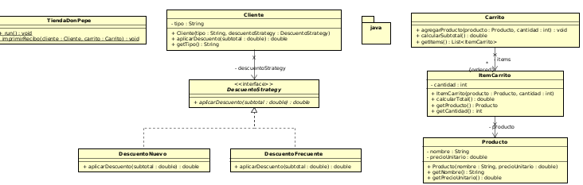
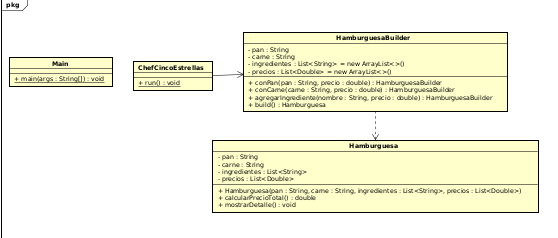

# Laboratorio 2 - Patrones de diseño

## integrantes 
- Daniel Ahumada
- Juan Camilo Torres
- Juan Manuel Neira

## Reto 1: El problema de la tienda de Don Pepe

**Patrón de diseño:** De comportamiento  
**Patrón utilizado:** Strategy  

### Justificación  

Se utilizó el patrón Strategy para manejar los distintos tipos de descuento según el tipo de cliente (nuevo o frecuente).  

Cada tipo de descuento se implementa como una estrategia diferente, permitiendo cambiar el cálculo sin modificar la clase principal de ventas. Esto cumple con el principio Open/Closed y evita condicionales innecesarios dentro del sistema.

---

## Reto 2: El chef de 5 estrellas

**Patrón de diseño:** Creacional  
**Patrón utilizado:** Builder  

### Justificación  

Se utilizó el patrón Builder porque la hamburguesa se construye paso a paso con ingredientes opcionales.  

Este patrón permite crear objetos complejos de forma flexible, agregando solo los ingredientes seleccionados por el usuario sin necesidad de múltiples constructores. Además, facilita la personalización y mantiene el código organizado y extensible.

